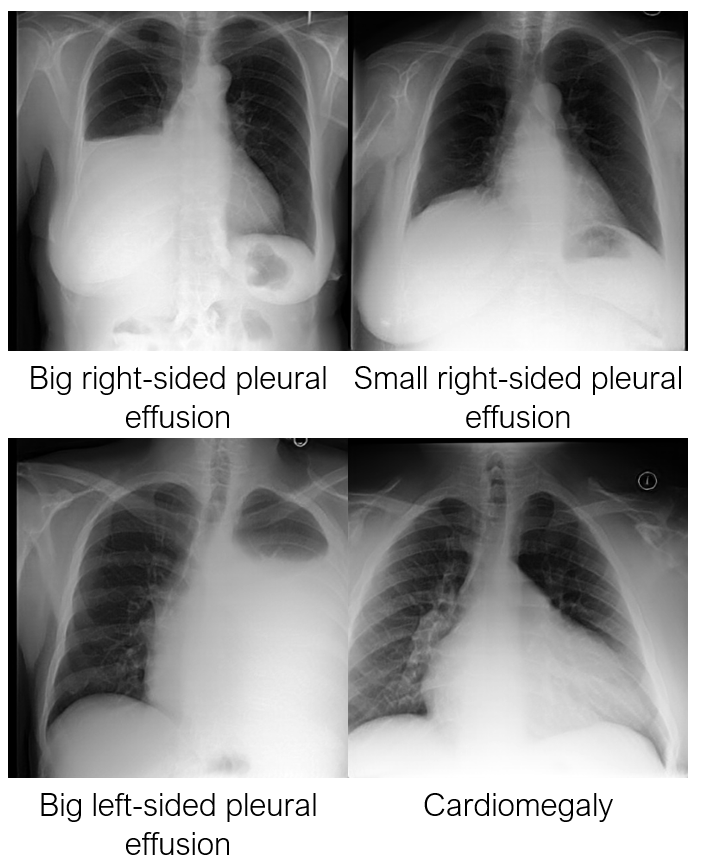

# Description

A diffusion model to synthetise X-Ray images based on radiological report impressions. 

# Model Overview
This model is trained from scratch using the Latent Diffusion Model architecture [1] and is used for the synthesis of
2D Chest X-ray conditioned on Radiological reports. The model is divided into two parts: an autoencoder with a
KL-regularisation model that compresses data into a latent space and a diffusion model that learns to generate
conditioned synthetic latent representations. This model is conditioned on Findings and Impressions from radiological
reports. The original repository can be found [here](https://github.com/Warvito/generative_chestxray)

 <br>
<p align="center">
Figure 1 - Synthetic images from the model. </p>

# Data
The model was trained on brain data from 90,000 participants from the MIMIC dataset [2] [3]. We downsampled the
original images to have a format of 512 x 512 pixels.

## Preprocessing
We resized the original images to make the smallest sides have 512 pixels. When inputting it to the network, we center
cropped the images to 512 x 512. The pixel intensity was normalised to be between [0, 1]. The text data was obtained
from associated radiological reports. We randoomly extracted sentences from the findings and impressions sections of the
reports, having a maximum of 5 sentences and 77 tokens. The text was tokenised using the CLIPTokenizer from
transformers package (https://github.com/huggingface/transformers) (pretrained model
"stabilityai/stable-diffusion-2-1-base") and then encoded using CLIPTextModel from the same package and pretrained
model.

# Examples of inference 

Here we included a few examples of commands to sample images from the model and save them as .jpg files. The available
arguments for this task are: "--prompt" (str) text prompt to condition the model on; "--guidance_scale" (float), the
parameter that controls how much the image generation process follows the text prompt. The higher the value, the more
the image sticks to a given text input (the common range is between 1-21).

Examples:

```shell
$ python -m monai.bundle run save_jpg --config_file configs/inference.json --prompt "Big right-sided pleural effusion" --guidance_scale 7.0
```

```shell
$ python -m monai.bundle run save_jpg --config_file configs/inference.json --prompt "Small right-sided pleural effusion" --guidance_scale 7.0
```

```shell
$ python -m monai.bundle run save_jpg --config_file configs/inference.json --prompt "Bilateral pleural effusion" --guidance_scale 7.0
```

```shell
$ python -m monai.bundle run save_jpg --config_file configs/inference.json --prompt "Cardiomegaly" --guidance_scale 7.0
```

## Using a new version of the model

If you want to use the checkpoints from a newly fine-tuned model, you need to set parameter load_old to 0 when you run inference,
to avoid the function load_old_state_dict being called instead of load_state_dict to be called, currently default, as it is 
required to load the checkpoint from the original GenerativeModels repository.

```shell
$ python -m monai.bundle run save_jpg --config_file configs/inference.json --prompt "Pleural effusion." --guidance_scale 7.0 --load_old 0
```

## References


[1] Pinaya, Walter HL, et al. "Brain imaging generation with latent diffusion models." MICCAI Workshop on Deep Generative Models. Springer, Cham, 2022.

[2] Johnson, A., Lungren, M., Peng, Y., Lu, Z., Mark, R., Berkowitz, S., & Horng, S. (2019). MIMIC-CXR-JPG - chest radiographs with structured labels (version 2.0.0). PhysioNet. https://doi.org/10.13026/8360-t248.

[3] Johnson AE, Pollard TJ, Berkowitz S, Greenbaum NR, Lungren MP, Deng CY, Mark RG, Horng S. MIMIC-CXR: A large publicly available database of labeled chest radiographs. arXiv preprint arXiv:1901.07042. 2019 Jan 21.
